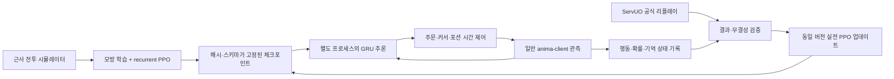

# Anima3 신경망 듀얼: 학습부터 실제 클라이언트까지

이 경로는 실제 가중치를 학습하는 순환 신경망 정책이다. 기존 Jev/LLM의
플레이북 선택·리플레이 기억 기능과 구별된다. 기존 실행 명령도 계속 사용할 수 있다.
공개 서버의 Tavern Mage를 자동 교체하지 않으며, 새 체크포인트는 후보로 저장된다.

## 설계



Pluto에서 참고한 것은 모델과 게임 프로세스의 분리, 반복되는 관측의 기억,
합법 행동 마스킹, 늦은 응답 폐기, 과거 상대를 포함한 평가 구조다.
Pluto의 StarCraft 가중치를 UO에서 재사용하지 않는다. 공개 바이너리만으로
Pluto의 학습 알고리즘은 확인되지 않았으므로 PPO는 이 프로젝트의 선택이다.
[바이너리 분석](PLUTO_BINARY_ANALYSIS.ko.md)에 확인된 사실과 추론을 구분했다.

### 구성

| 파일 | 책임 |
|---|---|
| `neural/schema.py` | 65개 공개 관측값, 23개 행동, 마스크, 스키마 fingerprint |
| `neural/sim.py` | 시드가 고정되는 양측 전투 환경, 지연 피해·자원·포션·쇼다운 |
| `neural/model.py` | 작은 인코더, GRU, 정책 헤드, 가치 헤드 |
| `neural/train.py` | 모방 학습, 순환 PPO/GAE, 과거 모델 상대, 평가, 실전 업데이트 |
| `neural/checkpoints.py` | SHA-256, 원자적 manifest 게시, `weights_only` 로드 |
| `neural/inference.py` | 추론 프로세스, 요청 ID·경기 epoch·응답 기한 검증 |
| `neural/executor.py` | 일반 게임 패킷을 통한 주문·이동·회복·포션 실행 |
| `neural/live.py` | 두 일반 계정 접속·준비·대련·리플레이·on-policy 데이터 수집 |
| `neural/online.py` | 검증된 데이터 업데이트 및 유한 횟수 실전 학습 반복 |

관측에는 자신의 HP/마나/스태미나·시약·포션, 보이는 상대 체력과 위치,
마법 워드, 독·마비, 실행 중 동작, 쇼다운 등이 들어간다. 상대 마나나
상대 인벤토리 같은 비공개 서버 상태는 입력하지 않는다.

행동은 대기·접근·후퇴·옆걸음, Weaken/Clumsy/Magic Arrow/Harm/Explosion/
Energy Bolt/Flamestrike, 회복·해독·독·마비·명상, 회복/해독/폭발 포션,
Explosion+포션+후속 주문 조합이다. 신경망이 선택하고 실행기는 커서와
시간 제어를 수행한다. 조합의 세부 패킷 순서는 학습 대상에 포함하지 않는다.

250ms 주기로 정책에 관측을 전달한다. 실행 중 행동은 hold만 허용하여
기억을 갱신하면서도 이미 진행 중인 주문·포션을 교체하지 않는다. 실제
네트워크 지연은 기록하며 실전 학습 할인율에는 경과 시간을 반영한다.

## 설치

Python 3.12가 필요하다. PyTorch는 선택 의존성이므로 기존 경로에는 필수가 아니다.

```sh
uv venv --python 3.12
uv pip install --python .venv/bin/python -e '.[neural,dev]'
```

## 시뮬레이터 학습과 평가

`models/duel-starter`에 실제 학습한 약 0.5MB 모델과 optimizer/RNG 상태를 포함했다.
바로 실행할 때는 아래 명령들의 체크포인트 경로 대신 이 경로를 쓸 수 있다.
학습을 재개할 수 있으며 전체 실험 기록은 로컬 `.logs/neural-v6`에 남겨 두었다.

```sh
.venv/bin/python -m anima3.neural train \
  --out .logs/neural-v1 --steps 100000 --bc-steps 8192 \
  --max-episode-steps 1200 --eval-games 40 --seed 17 --threads 2

.venv/bin/python -m anima3.neural evaluate \
  --resume .logs/neural-v1 --out .logs/neural-eval \
  --eval-games 40 --eval-seed 2100000000 --max-episode-steps 1200
```

`--resume`은 체크포인트와 옵티마이저 상태를 읽어 추가 학습한다.
학습 시드는 10억 미만, 평가 시드는 10억 이상으로 분리한다. 평가는 양측
스폰 위치를 번갈아 사용한다. 고정 스크립트 상대를 유지하면서 과거 체크포인트
상대를 섞는다. recurrent PPO는 실제 시퀀스에서 역전파하며, 종료와 시간 제한
중단의 가치 bootstrap을 구분한다. 손실·KL·가중치 버전·승무패를 기록한다.

기본 시뮬레이션은 300초 제한, 180초 쇼다운이다. 짧은 smoke test의 승무패를
전체 규칙의 성적으로 사용하면 안 된다. 테스트할 모델을 선택할 때 사용한
평가 세트 외에 별도의 최종 평가 시드를 사용한다.

### 시뮬레이션의 한계

ServUO의 정확한 복제 환경은 아니다. pre-AOS 캐스팅 공식과 포션 순서는
로컬 서버 소스에서 확인했지만 저항·회복·지연은 단순화하고 일부 무작위화했다.
지형 충돌, 패킷 지연, 장비·스킬별 모든 경우는 실제 서버에서 검증해야 한다.
학습 성적에 `real_server_strength_established: false`를 명시한다.

특히 pre-AOS `MagerySpell.GetCastDelay`는 기본 `Spell.CastDelayBase`보다
우선한다. 이 서버 코드에서 6서클은 약 **1.65초**, 7서클은 **1.9초**이며,
여기에 통신·서버 타이머 지연이 추가된다.

## 실제 서버 대련

전용 계정 두 개와 빌드된 `anima-bridge`, 게임 리소스가 필요하다.
비밀번호는 셸 환경에 설정하며 로그나 명령 인자로 직접 쓰지 않는다.
기존 bridge 내부 실행은 현재 프로토콜상 프로세스 인자를 사용하므로
프로세스 목록을 외부에 공유하지 않는다.

```sh
# SPAR_PASSWORD_A, SPAR_PASSWORD_B를 로컬 비밀 저장소에서 환경에 설정한 뒤:
.venv/bin/python -m anima3.neural live \
  --checkpoint .logs/neural-v1 --user-a TRAIN_ACCOUNT_A --user-b TRAIN_ACCOUNT_B \
  --opponent scripted --matches 2 --log-dir .logs/neural-live-v1
```

`--opponent self`는 두 신경망 클라이언트의 대련이며,
`--opponent-checkpoint PATH`로 고정된 과거 상대를 지정할 수 있다.
서버에는 일반 계정으로 접속하고 공개 명령/아이템으로 7GM·100/25/100,
7x+폭발 포션 **비랭크 training** 대련을 준비한다. 게임 서버 수정이나
관리자 전투 API를 사용하지 않는다.

사람의 직접 도전을 받을 때는 전용 계정 한 개로 아래 명령을 사용한다.
1라운드, 비랭크 7x+폭발 포션 도전만 수락한다. 이 경기는 자동 학습에 넣지 않는다.

```sh
# ARENA_BOT_PASSWORD를 로컬 비밀 저장소에서 환경에 설정한 뒤:
.venv/bin/python -m anima3.neural wait \
  --checkpoint .logs/neural-v1 --user TRAIN_ACCOUNT_A --matches 1
```

두 클라이언트는 독립 스레드에서 게임 연결을 처리하며 추론은 별도
프로세스다. 경기 ID·상대·규칙이 바뀌거나 연결 상태를 잃으면 중단한다.
늦은 추론 결과, 다른 경기의 응답, 선택한 option의 임의 교체가 발생한 경기는
학습 대상에서 제외하고 원인을 남긴다. 응답을 기다리는 동안 지형·상대가 바뀌어
행동이 불가능해지면 같은 option의 취소 결과로 기록한다. `policy_accepted`와
`execution_started`를 구분하여 실제 실행하지 않은 패킷을 실행했다고 기록하지 않는다.
원래 관측·마스크·선택·확률·기억을 유지한다. 선택한 option 내부의
fizzle·타깃 실패·포션 안전 처리는 실제 실행 결과로 기록하고 학습에 포함한다.
이런 실패를 제외하면 성공한 실행만 남는 편향이 생긴다. 실행기 소스 지문도 기록한다.

## 실제 대련으로 가중치 업데이트

```sh
.venv/bin/python -m anima3.neural update \
  --checkpoint .logs/neural-v1 --collection .logs/neural-live-v1 \
  --out .logs/neural-live-candidate

.venv/bin/python -m anima3.neural cycle \
  --checkpoint .logs/neural-v1 --user-a TRAIN_ACCOUNT_A --user-b TRAIN_ACCOUNT_B \
  --opponent scripted --matches 2 --iterations 3 --log-dir .logs/neural-cycle
```

각 반복은 새 모델로 경기를 수집한 뒤 그 버전의 데이터만 학습한다.
정책 SHA, feature/action fingerprint, GRU 기억 연속성, 기록한 행동의 확률과
가치를 다시 계산한다. 중복 사용한 경기·계정 조합도 거부한다.
수집은 한 번에 최대 100경기이며 같은 정책의 셀프플레이는 양측 데이터
200개까지 업데이트한다. 매 경기 검증 직후 결과를 저장하므로 후속 경기에서
연결이 끊겨도 이미 완료된 경기에는 `update`를 실행할 수 있다.

리플레이 원본의 SHA·순서·종료·training 규칙·양측 선수·승자를 검증한 뒤
마지막 행동에 승리 +1/패배 -1/무승부 0만 부여한다. 실전에서는 피해량을
추측해서 보상하지 않는다. 보존한 리플레이 해시는 훼손 검증용이며 서버의
전자 서명이 아니다. 수집 디렉터리를 신뢰할 수 있는 로컬 저장소에 둔다.

`cycle`은 후보 가중치를 다음 비랭크 수집에 사용한다. 공개 에이전트로의
승격을 의미하지 않는다. 실력 향상 여부는 별도 고정 상대·새 시드·서버 대련으로
판단해야 하며, 한두 경기 승패로 강해졌다고 결론 내리지 않는다.

## 2026-09-30 검증 결과

| 항목 | 확인한 결과 |
|---|---|
| 모델 | 127,384개 파라미터, GRU 128, 가중치 513,977바이트 |
| 학습 | 교사 데이터 16,384개 × 10 epoch, PPO 총 1,000,000 step·245 update |
| 학습 중 완료한 경기 | 현재 포션 5개 조건에서 근사 시뮬레이터 985경기 |
| 같은 진단 평가 40경기 | 15만 step 모델 0승 30패 10무 → 100만 step 모델 15승 25패 |
| 별도 최종 평가 | 새 시드 100개를 양쪽 위치에서 실행: 200경기 87승 111패 2무 |
| CPU 모델 계산 | 중앙값 0.065ms, p95 0.073ms; 네트워크/IPC 시간 제외 |
| 실전 최초 업데이트 | 검증된 패배 경기 95개 transition으로 PPO 4 epoch, 새로운 SHA 저장 |
| 실전 셀프플레이 | 양측 신경망이 일반 계정으로 접속·준비·주문·이동·포션·쇼다운 수행 |
| 실전 연속 학습 | 2경기 → 양측 데이터 4개·2,388 transition → PPO 2회; 새 가중치의 다음 경기 사용 확인 |
| 검증 | 관련 Python 테스트 96개와 Ruff 통과 |

최종 starter의 학습 조건은 다음과 같다. GPU 없이 CPU 2스레드로 실행했다.

```sh
.venv/bin/python -m anima3.neural train \
  --out .logs/reproduce-initial --steps 150000 --rollout-steps 4096 \
  --bc-steps 16384 --bc-epochs 10 --hidden-size 128 \
  --max-episode-steps 1200 --eval-games 40 --seed 17 --threads 2

.venv/bin/python -m anima3.neural train \
  --resume .logs/reproduce-initial --out .logs/reproduce-starter \
  --steps 850000 --rollout-steps 4096 --max-episode-steps 1200 \
  --eval-games 40 --seed 17 --threads 2

.venv/bin/python -m anima3.neural evaluate \
  --resume models/duel-starter --out .logs/fresh-evaluation \
  --eval-games 200 --eval-seed 2500000000 --max-episode-steps 1200
```

평가 상대는 고정 스크립트이며, 위 수치는 사람이나 실전 서버에 대한 승률이
아니다. 현재 starter의 greedy 평가는 `burst_flame`을 246회, Flamestrike를
728회 선택했다. 조합을 선택한 횟수이며 모든 연계의 동시 적중을 뜻하지 않는다.
Weaken/Clumsy 시작은 아직 선택하지 않았다.

초기 모델의 139승 56패 5무는 포션을 종류별 20개로 시작한 이전 환경의 결과다.
실제 지급량 5개로 고친 뒤 해당 모델은 같은 40경기 진단에서 2승에 그쳤다.
따라서 이전 수치를 현재 성적으로 사용하지 않는다. 수정 환경의 15만 step
모델도 새 200경기에서 0승 163패 37무로 실패했다. 이후 사전에 정한 85만 step을
한 번 추가했고, 모델을 고정한 뒤 최종 새 시드를 사용했다.

`models/duel-live-candidate`는 실제 데이터로 업데이트한 별도 실험 모델이다.
계보와 경기 기록은 해당 디렉터리의 README에 적었다. 실전 데이터 갱신 성공은
성적 향상의 증명이 아니므로 두 모델 모두 공개 서비스에 자동 승격하지 않았다.

실전 시험에서 나타난 Clumsy에 의한 캐스팅 취소, 늦게 도착한 주문 커서,
추론 대기 중 행동 가능 조건의 변경을 재현해 수정했다. 상태 응답을 잃은
시험은 실패 기록을 남기고 학습에서 제외했다. bridge의 선택적 전송 카운터를
기록하며, 응답 중단을 성공 경기나 정책 승리로 해석하지 않는다. 추가 진단에서
로컬 bridge 연결과 서버 TCP 연결을 대응시켰고, 서버 전송 대기 55,358바이트와
16회 재전송을 확인했다. 외부 네트워크의 전송 장애 증거이며 경로 손실·MTU 중
어떤 근본 원인인지는 확정하지 못했다. 진단 추가 자체가 통신을 고친 것은 아니다.

최신 수집기는 준비 중 보이는 상대의 공개 체력바를 요청한다. 첫 V6 실전에서는
초기 상대 HP가 미수신인 채 판단하는 차이를 확인했다. 서버가 허용하는 공개
HP만 사용하고 상대 마나나 인벤토리는 읽지 않는다.

### 서버 내부 실행 검증

미국 서버의 `/opt/uoarena/anima3-neural-lab-20260930`에 Python 3.12.3,
CPU 전용 PyTorch 2.14.0 환경을 만들었다. 두 클라이언트가 서버 내부에서
접속해 외부 전송 경로를 거치지 않고 최종 V6 모델의 대련·수집·학습을 완료했다.

- [검증 경기](https://arena.uotavern.com/replay/?replay=b470dc944875413194d96fcc97b8e079):
  신경망 선수 패배, 피해 91·회복 64·포션 투척 2회·자해 0.
- 첫 정책 관측부터 상대 공개 HP 수신 확인.
- 83개 결정을 리플레이와 검증한 뒤 PPO 4 epoch, 332개 step 최적화.
- 부모 `7c0cbe1a0472` → 실전 후보 `2953462ad056`.
- 실제 데이터로 가중치가 바뀌었음을 확인했으며, 이 한 경기로 실력 향상을
  주장하지 않는다. 다음 대련용 후보와 optimizer/RNG를 함께 보존했다.

각 모델 SHA, 경기별 성적, 사용/제외 여부와 원인은
[실험 기록](experiments/2026-09-30-neural-duel.json)에 보존했다.

## Jev/LLM과의 관계

기존 `anima3.strategy` 경로는 그대로 남아 있다. Jev/LLM의 긴 응답은
신경망 전투 루프에 삽입하지 않는다. 리플레이 분석·전략 제안은 바깥에서
수행하고, 실제 정책 변화는 위의 기록·학습·평가 과정으로 확인한다.

## 참고

- [PPO 원 논문](https://arxiv.org/abs/1707.06347)
- [PyTorch GRU](https://docs.pytorch.org/docs/stable/generated/torch.nn.GRU.html)
- [Pluto 공식 저장소](https://github.com/tscmoo/pluto)
