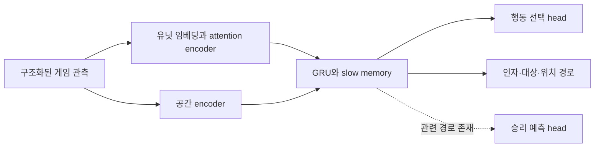

# Pluto 바이너리 분석: Anima3에 적용할 것

분석일: 2026-09-30 · 대상: `cog2026-2578600` · 방식: 해시 검증, PE 분석, 가중치 파싱, 정적 역어셈블.
Windows 프로그램을 실행하거나 게임 성능을 벤치마크한 결과는 아닙니다.

## 1. 확보한 파일과 검증

[공식 릴리스](https://github.com/tscmoo/pluto/releases/tag/cog2026-2578600)의 ZIP과
DLL·EXE·가중치 각각을 공개 SHA256과 대조해 모두 일치함을 확인했습니다.

| 파일 | 실제 크기 | 분석 결과 |
|---|---:|---|
| ZIP | 285,549,634 B | 공개 해시 일치, ZIP CRC 검사 통과 |
| `pluto.dll` | 465,934 B | x86 PE32, `gameInit`/`newAIModule` export |
| `pluto/pluto_infer.exe` | 1,638,912 B | x86-64 PE32+, CPU 추론 엔진 |
| `pluto/pluto_weights.bin` | 320,491,920 B | 자체 PLWB 형식, 모델 설정 및 텐서 목록 포함 |

로컬 완성 실행 파일: 이 worktree의 `.logs/pluto/extracted/` 아래 DLL과 EXE.
전체 ZIP 및 가중치: arena 서버의 `/tmp/pluto-analysis-cog2026/`에 보관했습니다.
로컬 대용량 전송은 느려 중단했고, 원본 전체의 해시·텐서·스케일 검사는 서버의
임시 분석 경로에서 수행한 후 결과 메타데이터를 가져왔습니다. 서버 게임 파일은
수정하지 않았습니다. 이 Mac은 arm64이며 실행 벤치마크는 수행하지 않았습니다.

검증 자료: [manifest](analysis/pluto-cog2026/manifest.json),
[PE 정보](analysis/pluto-cog2026/binaries-summary.json),
[역어셈블 근거 주소](analysis/pluto-cog2026/disassembly-findings.json).

## 2. 실제 가중치에서 복원한 구조

README만 읽은 추측과 구분되는, 배포 파일의 메타데이터 및 텐서 shape로 확인한 내용입니다.

| 항목 | 확인값 |
|---|---|
| 텐서 수 / 총 파라미터 | 269 / **315,040,001** |
| 입력 임베딩 | 유닛 종류 228, 소유자 3, 명령 종류 189 등의 임베딩 |
| 연속 입력 | 유닛 특성 109개; global projection 입력 292개 |
| 유닛 encoder | 6층, 모델 차원 768, 12 attention heads; QKV와 gated FFN 텐서 존재 |
| recurrent memory | `d_gru=4096`, spatial/unit/slow memory에 대한 projection 존재 |
| slow memory 설정 | 차원 1024, cache 128, period 8, 4층, 8 heads |
| 행동 출력 | `action_head.weight=[20,4096]` |
| 인자 출력 | `arg_head.weight=[233,768]` |
| 대상 지정 | 별도 query/key projection을 가진 `target_head` |
| 위치 처리 | spatial encoder, coarse/fine 경로, convolution, unit-aware targeting 텐서 |
| 승리 관련 출력 | 실제 배포 텐서에 `solo_win_head`가 존재 |
| 모델 최대 유닛 수 | 768 |

여기서 20개 행동의 정확한 ID 의미, 109/292개 특성의 전체 의미, forward의 모든
연산 순서는 복원하지 않았습니다. 구성과 텐서 이름이 의미하는 역할은 강한 근거가
있지만, 완전히 재구현한 모델과 같은 수준의 검증은 아닙니다.

파라미터의 약 56%가 `gru.*` 그룹에 있습니다. 이 그룹은 GRU와 slow memory를
함께 포함합니다. 단순히 현재 관측으로 행동 하나를 고르는 구성보다, 과거 상태를
유지하는 데 상당한 용량을 배정한 구조로 해석할 수 있습니다.



도식은 설정과 텐서 이름에 따른 개략적인 해석이며, 정확한 실행 그래프는 아닙니다.

### 양자화는 혼합 형식

| 저장 dtype | 텐서 수 | 파라미터 수 |
|---|---:|---:|
| INT8 | 133 | 311,372,544 |
| BF16 | 22 | 3,312,896 |
| FP32 | 114 | 354,561 |

파일 최상위 `dtype`은 float32이고, 각 텐서의 override가 우선합니다.
INT8 스케일 254,958개가 따로 저장되어 있고, 모두 유한한 양수임을 검사했습니다.
텐서·스케일 범위의 중복, payload 경계, dtype별 byte 수를 검증했습니다.
엔진 역어셈블에는 INT8 dot-product 명령 `vpdpbusd`가 실제로 존재합니다.
정확한 양자화 학습/보정 절차는 확인하지 못했습니다.

### 파일 형식

- offset 0: `PLWB` magic, 4바이트
- offset 4: little-endian uint32 버전 1
- offset 8: little-endian uint64 JSON 길이 55,320
- offset 16: JSON 메타데이터
- JSON 뒤 zero padding 24바이트를 거쳐 **64바이트 정렬**
- offset 55,360: 320,436,560바이트 payload
- tensor offset은 payload 기준. INT8은 별도 scale offset과 길이를 가짐

[원본 메타데이터](analysis/pluto-cog2026/weights-header.json)와
[계산한 모델 요약](analysis/pluto-cog2026/model-summary.json)을 함께 보존했습니다.

## 3. 실행 바이너리에서 확인한 핵심

### 게임과 추론의 분리

DLL에는 process 생성, file mapping, event 동기화 관련 Windows API가 있습니다.
EXE에는 대응되는 mapping/event API와 pipe fallback 진단 경로가 있습니다.
공유 메모리 헤더 검증 코드는 다음을 비교합니다.

| 헤더 offset | 확인하는 값 |
|---:|---|
| 0 | magic `PLSM` (`0x4D534C50`) |
| 4 | protocol version 3 |
| 8 | 구조 크기 548,736 (`0x85F80`) |
| 12 | protocol maximum units 1,024 |

모델 한도 768과 프로토콜 한도 1,024는 서로 다릅니다. 요청/응답 구조 전체를
복원한 것은 아니므로 이 표만으로 호환 클라이언트를 만들 수는 없습니다.

### 판단 주기와 행동 지연을 구분

- 모델 설정의 판단 주기: **6 game frames**.
- DLL의 지연 검사에서 기대하는 행동 적용 지연: **4 frames**.
- 실제 관측값과 4를 비교하고, 다르면 진단을 남기는 분기를 확인했습니다.
- 결정에 대응하는 관측을 보유했는지 검사하고, 없으면 해당 응답을 처리하지
  않는 분기가 있습니다. 늦어진 사이 사라진 유닛을 집계하는 진단도 존재합니다.

근거: DLL VA `0x63F8C5B0`의 비교와 `0x63F8C5CF`의 오류 진단 참조,
`0x63F8D6A8`의 관측 보유 검사. 주소는 이 해시의 이미지 VA이며 실제 로드 주소가 아닙니다.

[개발자 README](https://github.com/tscmoo/pluto)는 늦은 추론에 맞춰 게임을 기다리는
동작과 제한 시간 모드를 설명합니다. UO 공개 서버에서는 개인 봇 때문에 서버
시간을 멈출 수 없으므로, Anima3에는 기한 내 실행과 늦은 결정의 폐기가 필요합니다.

### 상대별 오프닝 통계

DLL에는 상대별 빌드 승패와 fractional credit, 업데이트 후 선택 확률을 기록하는
진단이 있습니다. `Thompson draws` 문구와 그 진단에 전달하는 10,000 상수도
확인했습니다. 이는 선택 확률 추정용 표본 수의 근거이며, 학습 경기 수 또는
실제 선택 알고리즘의 모든 세부 구현을 증명하는 숫자는 아닙니다.

따라서 배포 모델의 경기 간 적응에서 오프닝 통계가 역할을 한다는 근거가 있습니다.
실행 파일이 매 경기 신경망 가중치를 재학습한다는 증거는 찾지 못했습니다.

## 4. 확인하지 못한 것

- 강화학습 알고리즘, reward, optimizer, rollout 길이, 학습 자원과 총 경기 수
- 인간 플레이 데이터 또는 모방학습 사용 여부
- 모든 입력 특성·행동 ID·forward 연산 순서와 상대별 bandit의 전체 수식
- 이 Mac에서의 실제 추론 속도 또는 UO에서의 성능

설정에는 `adjoint_clip`, KL 관련 필드 등이 있지만, 이것만으로 PPO 등 특정
학습 알고리즘이라고 단정할 수 없습니다. `opp_predict=true`처럼 설정이 남아도
일부 head는 `stripped_prefixes`로 제거됐으므로 실제 실행 경로와 구분해야 합니다.

## 5. Anima3에 적용할 설계

| Pluto에서 얻은 근거 | Anima3의 다음 구현 |
|---|---|
| 행동 적용 지연을 별도로 측정 | 관측·판단·전송·서버 효과에 ID와 timestamp를 연결하고 p95/p99 지연 계측 |
| 결정 당시 관측을 보존 | `match/round/opponent/observation` 식별자로 응답을 검증하고 오래된 결정 폐기 |
| 독립 추론 프로세스 | LLM/Jev 지연이 시전·포션 퓨즈 실행을 막지 않도록 실행기를 분리 |
| recurrent/slow memory | 상대의 시전 이력, 포션 준비, 방해와 회복 리듬을 기억하는 작은 전투 정책 |
| 행동·인자·대상·위치 경로 구분 | 시전 종류 선택과 타깃·이동을 구조화하고 합법 행동 제한 적용 |
| 상대별 오프닝 통계 | Weaken/Clumsy 및 연계 패턴을 상대별 결과로 선택하고 별도 평가 |

우선 작은 UO 전용 정책부터 시작하는 것이 타당합니다. Pluto는 수백 유닛과
생산·이동·대상을 다루므로 315M 규모를 그대로 복제할 필요가 있다는 근거는 없습니다.
현재 진행 중인 20경기 실험의 전투 코드는 이 분석 때문에 변경하지 않았습니다.

당장 우선할 작업은 **실행 지연과 준비된 포션 처리의 계측·분리**입니다.
그 위에 관측→행동 경험 기록, recurrent 정책 학습, 과거 정책과의 자가 대전,
동결 후보의 별도 평가를 단계적으로 연결합니다. 이는 구현 제안이며 완료된 RL
학습 기능이나 성능 향상을 의미하지 않습니다.

## 6. 재현

분석 스크립트: [`tools/analyze_pluto.py`](../tools/analyze_pluto.py).
`pefile==2024.8.26`이 있는 Python 환경에서 다음과 같이 실행합니다.

```sh
python tools/analyze_pluto.py /path/to/pluto-cog2026-2578600.zip \
  --extract .logs/pluto/extracted --out .logs/pluto/reproduced
```

스크립트는 핀 고정된 공식 해시를 검사하고, 알려진 멤버만 추출하여 PE 메타데이터와
가중치를 읽습니다. DLL/EXE를 실행하지 않습니다. 수동 역어셈블 근거는 별도 JSON의
이미지 주소에서 `objdump -d`로 재확인할 수 있습니다.
